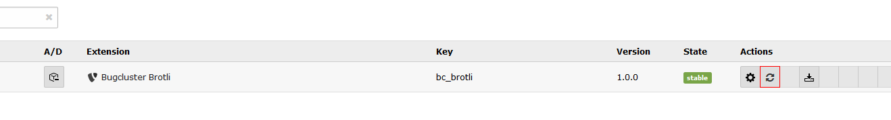
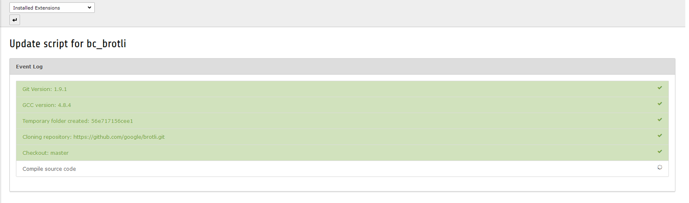

.. ==================================================
.. FOR YOUR INFORMATION
.. --------------------------------------------------
.. -*- coding: utf-8 -*- with BOM.

.. include:: Includes.txt

.. _admin-manual:

Administrator Manual
====================

Requirements
------------
* TYPO3 CMS 7.6.0 or later
* GNU Compiler Collection (GCC)
* The update script requires a browser that support server send events, `see <http://caniuse.com/#feat=eventsource>`_

Installation
------------
Simply extract or clone the content into the *typo3conf* folder. After enabling the extension in the backend you have put the brotli binary into the extension folder at path: *Resources/Private/Bin.* Therefore you can use the prepared update script.

After the installation is completed you have to add the following code into the *.htaccess* file of your TYPO3 root directory.

.. code-block:: apache

	<Files *.js.br>
	   AddType "text/javascript" .br
	   AddEncoding br .br
	</Files>
	<Files *.css.br>
	   AddType "text/css" .br
	   AddEncoding br .br
	</Files>

